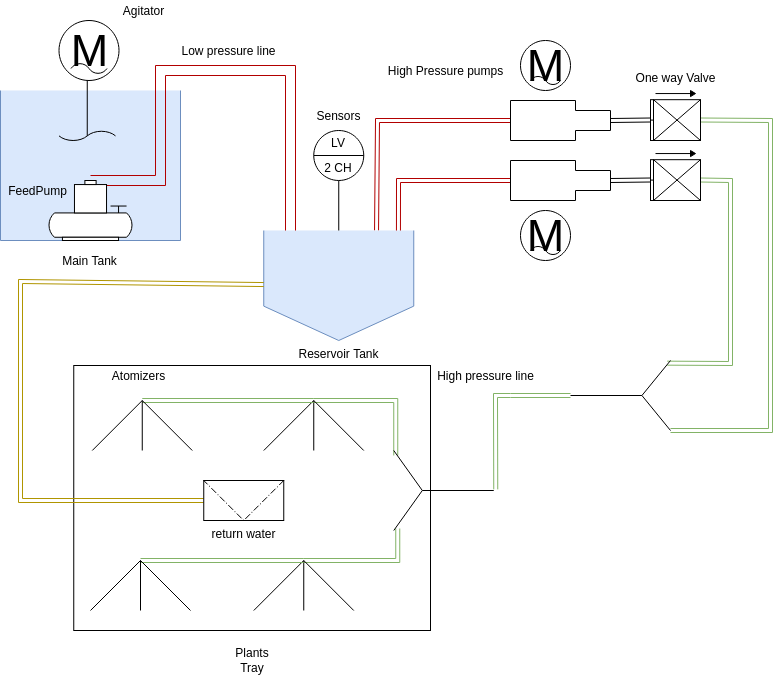

# Aeroponino
A simple Arduino-based machine for taking care of an aeroponics system.
#### AeroWhat?
Aeroponics is the process of developing plants in a greenhouse without using land or any other supporting aggregate. The plants, in fact, are artificially supported and their feeding is guaranteed by water nebulization systems, enriched with mineral fertilizers, which directly affects the root system of the plant.
The goal of aeroponics is to obtain conditions that increase the development, health, flowering and fruiting of the plant through greenhouse cultivation and the use of nutrient-rich solutions sprayed on bare roots. The closed environment, ideally isolated from the outside, combined with the absence of soil also makes it possible to cancel the exposure of plants to pests and pathogens, further facilitating their development. The level of oxygenation of the root system that this technique allows is also remarkable. Unlike hydroponics, the plant is not submerged in nutrients but suspended in an environment that is periodically sprayed with substances. At the same time this allows to have a greater impact of the air, necessary for the development of the plant and to save substances and water which in any case is recovered from the bottom of the structure and put back into circulation.
## Hardware
The hardware required to build the system was chosen to be readily available in any hardware store and designed to be more compact possible. 
### Piping
The connection diagram of the tanks is the following:

### Wiring
### Structure
## Firmware
### Finite State Machine
### Serial Interface
# Future